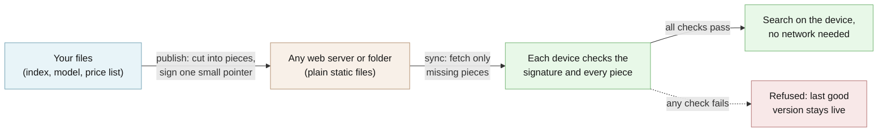

# EdgeProc

For Python apps that ship data to devices: each one checks it's genuine, downloads only changes, and searches offline.

[](https://github.com/hseshadr/edge-proc/actions/workflows/dagger.yml)
[](CHANGELOG.md)
[](LICENSE)

[Docs](docs/ARCHITECTURE.md) · [Quickstart](docs/QUICKSTART.md)

```text
input:  a two-product catalog, published and signed on your machine, then pulled into a
        "device" folder; then one new file; then one piece corrupted on the server
output: synced v1.0.0 manifest=71d733a8dddb chunks_fetched=1 chunks_reused=0 bytes_fetched=70
        synced v1.0.1 manifest=18499ab39ead chunks_fetched=1 chunks_reused=1 bytes_fetched=27
        [bundle.integrity_failed] sync failed: stored chunk failed to decompress
        exit=1
```
<sub>Real output of the example below.</sub>

## At a glance

- **What it does** — Like a game console's update system (download only the patch, and check
  it really came from the studio before installing), but for your app's own data: a search
  index, a price list, a machine-learning model. Once the data has landed, EdgeProc can also
  search it on the device, with no server in the loop.
- **Who it's for** — A Python developer whose app sends the same data to many laptops, phones,
  or small boxes they don't control, and who needs each one to notice a corrupted or swapped
  file instead of quietly giving wrong answers. For example, a shop app that wants product
  search to keep working with no internet and no per-search cloud bill.
- **What stays on your device / what leaves it** — Stays: everything. EdgeProc has no server,
  no account, and no analytics; the signing key never leaves your build machine. Leaves: only
  the downloads you ask for, sent to the folder or web address you give `sync` (which sees an
  ordinary file request, never your search queries), and — only if you set
  `EDGEPROC_ALLOW_MODEL_DOWNLOAD=1` on a build machine — one request to Hugging Face (a public
  model-hosting site) for the search model. Without that setting it refuses rather than
  downloads. Full table: [privacy and data flow](docs/OPERATIONS.md#privacy-and-data-flow).
- **Runs on** — Python 3.13 or newer, tested in CI on Linux. Signing and syncing need only
  small dependencies; on-device search adds FAISS and PyTorch (about a 950 MB install).
- **Not for** — A hosted service (there is nothing to sign up for; it is a library your app
  embeds). Not a two-way folder sync like Dropbox: one publisher signs, many devices read.
- **Status** — Beta (pre-1.0). This README documents v0.5.0, which adds the key-rotation
  keyring; released versions and dates are in the [CHANGELOG](CHANGELOG.md).

## Try it in 60 seconds

In a Python 3.13+ virtual environment:

```bash
pip install "edge-proc[bundles]"
```

```bash
mkdir -p demo/src && cd demo
echo '{"p1": "red running shoes", "p2": "waterproof hiking boots"}' > src/catalog.json
edgeproc keygen --out keys          # private.key signs; public.key goes to every device
edgeproc publish --src src --origin-dir origin --key keys/private.key --bundle-id catalog --version 1.0.0 --pretty
edgeproc sync --base-url origin --cache-dir cache --key keys/public.key --materialize-to device --pretty
cat device/catalog.json             # the device's checked copy

echo 'spring price list' > src/prices.txt    # add one file, publish again
edgeproc publish --src src --origin-dir origin --key keys/private.key --bundle-id catalog --version 1.0.1 --pretty
edgeproc sync --base-url origin --cache-dir cache --key keys/public.key --materialize-to device --pretty

printf 'tampered' > "origin/chunk/$(ls origin/chunk | head -1)"   # corrupt the server's copy
edgeproc sync --base-url origin --cache-dir new-device --key keys/public.key --pretty; echo "exit=$?"
```

```text
wrote keys/private.key and keys/public.key
key_id 9a8763e7c7fe05a1
published v1.0.0 manifest=71d733a8dddb
synced v1.0.0 manifest=71d733a8dddb chunks_fetched=1 chunks_reused=0 bytes_fetched=70
{"p1": "red running shoes", "p2": "waterproof hiking boots"}
published v1.0.1 manifest=18499ab39ead
synced v1.0.1 manifest=18499ab39ead chunks_fetched=1 chunks_reused=1 bytes_fetched=27
[bundle.integrity_failed] sync failed: stored chunk failed to decompress
exit=1
```

What happened: `origin/` is what you would put on any web server. The first `sync` checked
the signature and every piece, then wrote the catalog to `device/`. After you added one file,
the second `sync` downloaded only that new piece (27 bytes) and reused the rest. When a piece
on the server was corrupted, a fresh device refused the whole release and exited with an
error; it never got an `active` version to serve. No network was used — `origin/` is a local
folder. Output from edge-proc 0.5.0; the manifest hashes repeat on every run, while the
`key_id` line names your freshly generated key, so yours will differ.

More runnable examples: [`examples/`](examples/) — `bash examples/run_loop.sh` runs the whole
path including on-device search (its first run downloads an 87 MB search model on the
simulated build machine, so allow about a minute).

<!-- ======================== BELOW THE FOLD ======================== -->

## How it works

You publish a folder once: EdgeProc cuts every file into pieces, names each piece by a
fingerprint of its contents, and signs one small "version pointer" that vouches for the whole
list. You put that output on any plain web server or folder. Each device downloads only the
pieces it doesn't already have, checks the signature against the public key you gave it, and
checks every piece against its fingerprint. Only when everything checks out does the new
version go live; otherwise the device refuses it and keeps the last good version. The device
can then search the data locally, using a search model that travelled inside the same signed
release.



**[Explore the interactive architecture map →](docs/architecture/index.html)**
(Archify, generated from [`docs/architecture/runtime.architecture.json`](docs/architecture/runtime.architecture.json)).
Deep dive: [docs/ARCHITECTURE.md](docs/ARCHITECTURE.md).

### The problem, as a story

When a video game ships an update, your console doesn't re-download the whole 80 GB game. It
downloads a small patch. And before it installs anything, it checks a signature to confirm the
patch really came from the studio — not from someone who slipped a modified file onto a mirror.

Plenty of software that isn't a game needs exactly that and rarely gets it. A search index. A
machine-learning model. An offline catalog or price list. These files are big, they change
often, and they have to land on phones, browsers, and small boxes you don't own or control.

Which leaves two awkward questions:

1. **Is this actually my file?** It crossed someone else's network and sat on someone else's
   CDN. If it arrived corrupted — or quietly swapped — would you find out? Or would your app
   keep running and just start giving wrong answers?
2. **Do I have to send all of it again?** If one row of a 400 MB index changed, making every
   user re-download 400 MB is a real bandwidth bill and a bad experience.

**EdgeProc is a Python library that answers both.** You publish once; any number of devices
pull the update, verify it genuinely came from you and arrived intact, and fetch only the
bytes that actually changed.

### How it answers them

- **Every file is split into chunks, and each chunk is named by a fingerprint of its own
  contents.** That fingerprint (a SHA-256 hash) changes completely if even one byte changes —
  so a corrupted or tampered chunk no longer matches the name it was requested under, and is
  refused. The technical name for this is a *content-addressed store*, or CAS.
- **Exactly one small file is signed, and it vouches for everything else.** The publisher signs
  a *version pointer*: a few bytes saying "version 1.0.1 is live, and its file list is
  `<hash>`". That file list (the *manifest*) names every chunk by hash. So one signature check
  covers the entire release, and there's only one secret to protect.
- **Chunk boundaries follow the content, not fixed offsets.** Edit one line in the middle of a
  big file and only the chunk holding that line changes — everything after it keeps its old
  fingerprint instead of shifting. That's what makes the next update a small delta.
- **If verification fails, nothing is installed.** Not "installed with a warning." The sync
  exits non-zero and the previous good version stays live.

Once the data has landed, EdgeProc also runs the search and ranking **on the device** — no
embedding API, no vector database, no ranking server in the request path.

Chunking is content-defined (GearCDC) and chunks are zstd-compressed. Add `--http` to `sync`,
serving `origin/` over any static HTTP server or CDN, to go over the wire instead of the
filesystem; the contract is identical and only the transport changes.

## What you can do

- Mint a signing key, and rotate keys later without a flag day — [key rotation](#key-rotation-a-keyring-trust-root)
- Publish a folder as a signed release that any static web server or CDN can host — [architecture](docs/ARCHITECTURE.md)
- Pull a release onto a device, fetching only the pieces that changed and refusing anything that fails a check — [quickstart](docs/QUICKSTART.md)
- Ship the search model inside the release so the device never downloads one — [full walkthrough](#full-walkthrough-search-a-catalog-on-the-device)
- Search, embed, or rank text on the device: meaning-based search, keyword scoring, or both combined — [Python usage](#prefer-to-stay-in-python)
- Get machine-readable refusals (every error carries a stable code) — [configuration](#configuration)
- Clean up old cached pieces with `edgeproc gc` — [operations](docs/OPERATIONS.md)

## Why this and not X

Moving both the data and the compute to the device buys four things at once:

- **The Nth query costs nothing.** Per-request cloud bills for embeddings, vector search, and
  reranking collapse into a one-time bundle build.
- **Traffic spikes land on clients, not your servers.** A launch or a front-page link is
  absorbed by users' own devices. Nothing to autoscale, nothing to fall over.
- **It survives weak or absent connectivity.** Ship the embedding model in the bundle next to
  the index, and after one sync the device needs no network at all to keep answering queries.
  If the model isn't there, EdgeProc refuses the query instead of quietly going to fetch one.
- **Tampering is caught, not tolerated.** Verification is fail-closed, and because the data is
  searched locally, it never leaves the device to begin with.

Typical shapes: an app that recommends the next item with no per-search cloud bill however many
users you have; a privacy-sensitive tool where user data must never leave the machine; an edge
or IoT box that needs fast local search without standing up a backend.

| Alternative | Where it is the better choice | What EdgeProc adds |
| --- | --- | --- |
| A hosted search or vector-database API | You want zero ops on the client, always-fresh data, and the per-query cost is fine | Queries never leave the device, work offline, and cost nothing per search |
| Plain HTTPS download plus a checksum file | One small file, rarely changed, from a server you fully trust | A signature pinned on the device (a swapped checksum file cannot fool it), delta updates, rollback refusal |
| A full software-update framework such as TUF | You need delegated roles, threshold signing, or remotely distributed revocation | A much smaller surface: one signed pointer, one pinned key or keyring, plus on-device search |
| rsync or a general file-sync tool | Two-way sync between machines you control | Devices you don't control verify every piece against a signed release before using it |
| Doing nothing (just download the file) | Nobody can tamper with the path and bandwidth is free | A corrupted or swapped file is refused instead of silently served |

## Security and trust model

- **Verified:** one signed version pointer (Ed25519, checked against a public key or keyring
  you pin on the device), the file list it names, and every downloaded piece against its
  SHA-256 fingerprint. A shipped search model can be pinned by digest
  (`EDGEPROC_MODEL_DIGEST`).
- **Refuses rather than warns:** no trust root means `sync` refuses to run; a bad signature, a
  tampered piece, or a rolled-back pointer stops the sync with a non-zero exit and nothing is
  promoted, and so do an expired pointer and a revoked key. With no local model, search refuses
  instead of downloading one.
- **Not protected:** a compromised device or build machine, a stolen private key before you
  revoke it (revocation takes effect when you update each device's pinned keyring — there is
  no remotely fetched revocation list), and what your own app does with the data after it is
  verified. The memory budget is admission control, not a hard limit (see
  [below](#the-typed-result-and-the-taskbudget-model)).
- **Verify a release:** PyPI releases are published from CI with
  [PEP 740](https://peps.python.org/pep-0740/) provenance. Check a wheel with
  `pip install pypi-attestations && pypi-attestations verify pypi --repository https://github.com/hseshadr/edge-proc pypi:edge_proc-0.5.0-py3-none-any.whl`.
  The release procedure is in [docs/OPERATIONS.md](docs/OPERATIONS.md#release-evidence).

See [SECURITY.md](SECURITY.md) for reporting a vulnerability. The threat model, recovery
contract, and key-rotation runbook are in [docs/OPERATIONS.md](docs/OPERATIONS.md).

### The verification chain, precisely

`sync` verifies the pointer signature against the pinned trust-root pubkey **before trusting
anything**, diffs the manifest against the local cache, fetches only missing chunks, re-checks
every chunk against its content address, and only then atomically promotes the new version. A
tampered chunk fails its content-address check; a forged pointer fails its signature check —
both exit non-zero with no traceback, and neither promotes into the cache.

### Key rotation: a keyring trust root

`--key` / `EDGEPROC_TRUST_ROOT_PUBKEY_PATH` accepts the raw `public.key` above (a keyring of
one — exactly the single-key behavior) or a JSON keyring of several keys plus a revocation
list. A pointer can name the key that signed it (`publish --stamp-key-id`) and carry a signed
expiry (`publish --expires-in 7d`); a revoked key never verifies, an unknown one is refused,
and an expired pointer is refused after its signature checks out. The `sequence` rollback
floor holds across keys. The keyring ships in 0.5.0.

```bash
uv run edgeproc keyring init keys/public.key new-keys/public.key --out keyring.json
uv run edgeproc keyring revoke keyring.json <old-key-id>   # after the publisher switched
uv run edgeproc keyring show keyring.json --pretty
```

Both stamps are **off by default**, because a consumer older than the keyring release refuses
a pointer carrying them: upgrade every consumer first, then turn stamping on. The overlap
procedure, the compromised-key path, and the re-sign cadence are in the
[operations runbook](docs/OPERATIONS.md#key-rotation-and-compromised-key-runbook).

## What this proves / what it does not prove

| Claim | Evidence |
| --- | --- |
| A tampered piece or a missing trust root is refused, with a stable error code | The example above; the fail-closed tests under [`tests/bundles/`](tests/bundles/) and [`tests/cli/`](tests/cli/) |
| An update downloads only changed pieces | The example above (27 bytes for the second release); the delta step of `bash examples/run_loop.sh` |
| After one sync, search needs no network | [`tests/localvec/test_offline_model.py`](tests/localvec/test_offline_model.py) points every Hugging Face cache at an empty folder and proves the model loader is never constructed |
| Routing is deterministic, with no AI in the decision | Router tests under [`tests/core/`](tests/core/) |
| Every documented setting exists, and vice versa | `tests/test_release_contract_docs.py` checks the configuration table below field for field |
| Latency and memory stay under budget | `uv run python benchmarks/benchmark.py` prints your own numbers; recorded figures and hardware live only in [docs/OPERATIONS.md](docs/OPERATIONS.md#measured-evidence) |

`poe gate` is the product-quality portion of the hosted `Dagger` job. Dagger also runs the real
example, benchmark, locked dependency audit, exact snapshot plus full commit-history secret scan,
and workflow validation. A green local product gate alone is not evidence that those controls ran.

**Not proven here:** behavior on Windows or macOS in CI (CI runs Linux); a hard memory cap
inside FAISS or other native code; protection after a device itself is compromised; recall
quality of the default search model on your data.

## Install

EdgeProc is on PyPI as [`edge-proc`](https://pypi.org/project/edge-proc/). The heavy pieces sit
behind extras, so you pull only what you use:

```bash
pip install edge-proc                    # core + CLI (pure router, contracts)
pip install edge-proc[localvec]          # + FAISS vector runtime (EMBED / SEARCH / RANK)
pip install edge-proc[bundles]           # + manifest + checksum sync substrate
pip install edge-proc[localvec,bundles]  # full local substrate
```

To run the full walkthrough below, or to hack on EdgeProc itself, clone instead — one command,
no sibling checkouts:

```bash
git clone https://github.com/hseshadr/edge-proc.git
cd edge-proc
uv sync --all-extras   # core + extras + dev tooling
```

That Just Works — `edgeproc-core` resolves from
[PyPI](https://pypi.org/project/edgeproc-core/) (`edgeproc-core>=0.4.3`, the supported
core line), so `uv sync` fetches
everything; nothing else to clone. Co-developing `edgeproc-core` alongside
EdgeProc? Clone it next to this repo and add the path override commented in
`pyproject.toml`.

EdgeProc is **purely a dependency** — a library an application embeds, not a service you sign
up for. The core is tiny; the heavy machinery (FAISS, sync) is opt-in behind extras. It builds
on [`edgeproc-core`](https://github.com/hseshadr/edgeproc-core): the FAISS index here
is a concrete implementation of that library's `VectorIndex` Protocol.

**Artifact status:** This README documents EdgeProc 0.5.0. The
[PyPI project](https://pypi.org/project/edge-proc/) is the source of truth for versions
available from the registry; the [changelog](CHANGELOG.md) separates shipped behavior
from unreleased work.

## Usage & API

The CLI is `edgeproc`: `version` · `list-runtimes` · `keygen` · `keyring` · `publish` · `sync` ·
`route` · `gc`. Run `edgeproc --help` for every flag.

### Full walkthrough: search a catalog on the device

Run the complete path against a realistic outdoor catalog: build a local search index,
sign and publish it, sync it into a clean device cache, search it with the network
disabled, then prove the same device refuses to run without a verified model.

```bash
git clone https://github.com/hseshadr/edge-proc.git
cd edge-proc
uv sync --all-extras
bash examples/run_loop.sh
```

The first run downloads an 87 MB embedding model on the simulated build machine and can
take about a minute. The simulated device never downloads it: the model travels inside
the signed bundle.

Everything below was run to produce the output shown.

**The real shape, so nothing surprises you:** one short Python script, then five CLI
commands. The script exists because persisting an index is library work — there is no
`edgeproc build-index` verb, and pretending otherwise would just hide the interesting part.

Measured on a fresh clone into a fresh venv with cold caches (Apple Silicon, fast connection):

| | measured |
|---|---|
| `uv sync --all-extras` | 5.5 s, 75 packages |
| step 1, first run | 45 s — the one-time `all-MiniLM-L6-v2` download is 87 MB of it |
| steps 2–6 (`keygen` → `route`) | 21 s — publish and sync move that 87 MB model too |
| **total machine time** | **~70 s** |
| **total disk** | **~1.4 GB** — 947 MB venv (torch + FAISS) + ~500 MB the walkthrough writes |

The venv is what costs you a gigabyte. The other 500 MB is the 87 MB model as it passes
through `src/`, `origin/`, `cache/`, and `materialized/` — delete the walkthrough directory
and it all goes. Budget more wall-clock on a slow link; the download is one-time and every
later run reuses it.

```bash
git clone https://github.com/hseshadr/edge-proc.git
cd edge-proc
uv sync --all-extras   # ~950 MB venv; step 1 then downloads an 87 MB embedding model
```

#### 1. Make something worth shipping

A small product catalog, turned into a searchable index on disk — plus a copy of the embedding
model that built it, because the device will need that too. This is the one script in the
walkthrough; everything after it is a CLI command.

```bash
cat > save_index.py <<'PY'
import asyncio
from pathlib import Path

from edgeproc_core.vector_mgmt.core.types import IndexConfig, VectorEmbedding

from edgeproc.localvec.encoder import TextEncoder
from edgeproc.localvec.faiss_index import FaissVectorIndex

CATALOG = {
    "p1": "red running shoes",
    "p2": "waterproof hiking boots",
    "p3": "blue denim jacket",
    "p4": "trail running sneakers",
}


async def main() -> None:
    ids, texts = list(CATALOG), list(CATALOG.values())
    encoder = TextEncoder()
    index = FaissVectorIndex("catalog_idx", IndexConfig(dimension=encoder.dim))
    await index.insert(
        [
            VectorEmbedding(entity_id=i, embedding=v.tolist())
            for i, v in zip(ids, encoder.encode_texts(texts), strict=True)
        ]
    )
    index.save(Path("catalog_idx"))
    encoder.save(Path("model"))


asyncio.run(main())
PY

EDGEPROC_ALLOW_MODEL_DOWNLOAD=1 uv run python save_index.py
ls catalog_idx
du -sh model
```

```text
snapshots/
 87M	model
```

`EDGEPROC_ALLOW_MODEL_DOWNLOAD=1` is the only line in this walkthrough that touches the
network. You are on a build machine, so fetching the model here is fine — and the whole point
of saving it into `model/` is that the device never has to. EdgeProc will not make that fetch
without the opt-in: leave the variable off and step 1 refuses instead of quietly downloading.

#### 2. Mint a signing key

`private.key` stays on your build machine forever. `public.key` is what devices are given, and
it's the only thing they have to trust.

```bash
uv run edgeproc keygen --out keys
```

```text
wrote keys/private.key and keys/public.key
key_id 34750f98bd59fcfc
```

The `key_id` (yours will differ) names the key in a keyring. To rotate keys without a flag
day, pin a keyring instead of one key — see [Key rotation](#key-rotation-a-keyring-trust-root).

#### 3. Publish a signed release

Both the index and the model go into `--src`, so both get chunked and signed under the same
key. Shipping the model is what makes step 5 work with the network unplugged.

```bash
mkdir -p src && cp -r catalog_idx model src/

uv run edgeproc publish \
    --src src --origin-dir origin \
    --key keys/private.key \
    --bundle-id catalog --version 1.0.0 --pretty
```

```text
published v1.0.0 manifest=4587411eea91
```

`origin/` is now a plain directory of hash-named files. Put it behind any static web server or
CDN as-is — there is no application server to run.

#### 4. Pull it onto a device

```bash
uv run edgeproc sync \
    --base-url origin --cache-dir cache \
    --key keys/public.key \
    --materialize-to materialized --pretty
```

```text
synced v1.0.0 manifest=4587411eea91 chunks_fetched=2152 chunks_reused=0 bytes_fetched=83404167
```

83 MB, because this is the first sync and the model is most of it. Later syncs move kilobytes —
step 6 shows that.

#### 5. Search the file that just arrived

`materialized/` now holds the index *and* the model, both verified against the pinned key.
`--model-path` points at the model that just arrived, which is why this step needs no network.

```bash
cat > task.json <<'JSON'
{"kind": "search", "payload": {"query": "shoes for running", "k": 3}, "privacy_mode": "local_only"}
JSON

uv run edgeproc route \
    --index-dir materialized/catalog_idx \
    --model-path materialized/model \
    --task task.json --pretty
```

```text
success=True runtime=localvec latency=109.6ms
  p1  0.219
  p4  0.246
  p2  0.556
```

`p1` is "red running shoes" and `p4` is "trail running sneakers" — matched by meaning, on the
machine, with nothing in the request path but local code. The hashes and distances above
reproduce exactly; only `latency` varies by machine.

#### 6. Now watch it refuse to be fooled

This is the part worth trying yourself, because it's the whole point.

**Nothing changed? Then nothing is downloaded.**

```bash
uv run edgeproc sync --base-url origin --cache-dir cache --key keys/public.key --pretty
```

```text
synced v1.0.0 manifest=4587411eea91 chunks_fetched=0 chunks_reused=2152 bytes_fetched=0
```

**A small edit ships as a small delta.** Add a tiny signed release note without touching the
valid snapshot, publish `1.0.1`, then re-sync:

```bash
printf 'tiny edit\n' > src/release-note.txt

uv run edgeproc publish --src src --origin-dir origin --key keys/private.key \
    --bundle-id catalog --version 1.0.1 --pretty
uv run edgeproc sync --base-url origin --cache-dir cache --key keys/public.key \
    --materialize-to materialized --pretty
```

```text
published v1.0.1 manifest=3f0941c9725a
synced v1.0.1 manifest=3f0941c9725a chunks_fetched=1 chunks_reused=2152 bytes_fetched=19
```

19 compressed bytes instead of 83 MB — it fetched the one new chunk and reused the other
2,152, model included. The snapshot under `src/catalog_idx/snapshots/` remains valid.

**No model, no answers.** Drop `--model-path` and `route` refuses. It does not fall back to
downloading one, which is the whole reason step 5 can run on an unplugged machine:

```bash
uv run edgeproc route --index-dir materialized/catalog_idx --task task.json --pretty
echo "exit=$?"
```

```text
[config.missing] no local embedding model is configured, so EdgeProc will not load 'sentence-transformers/all-MiniLM-L6-v2': fetching it would need the network. Set EDGEPROC_MODEL_PATH to a local model directory (ship the model in the signed bundle and point at what `edgeproc sync --materialize-to` wrote), or set EDGEPROC_ALLOW_MODEL_DOWNLOAD=1 to permit a one-time fetch on a build machine.
exit=1
```

**No key means no sync.** There is no "just this once" mode:

```bash
uv run edgeproc sync --base-url origin --cache-dir cache2 --pretty; echo "exit=$?"
```

```text
[config.missing] no trust root: pass --key or set EDGEPROC_TRUST_ROOT_PUBKEY_PATH (refusing to sync)
exit=1
```

That `[config.missing]` prefix is a canonical error code, not decoration — every refusal
carries one, and `EDGEPROC_ERROR_FORMAT=json` turns the same refusal into a machine-readable
[RFC 9457](https://www.rfc-editor.org/rfc/rfc9457) object so a script can branch on it.

**Corrupt a chunk on the server and the device rejects the whole release.** Overwrite any file
under `origin/chunk/` and sync into a fresh cache:

```bash
printf 'corrupted' > "origin/chunk/$(ls origin/chunk | head -1)"
uv run edgeproc sync --base-url origin --cache-dir cache3 --key keys/public.key --pretty
echo "exit=$?"
ls cache3
```

```text
[bundle.integrity_failed] sync failed: stored chunk failed to decompress
exit=1
chunks
manifests
```

Compare that to the healthy `cache/`, which has an `active` pointer file. `cache3/` never got one:
the bad version was never promoted, and a device in this state keeps serving the last good
version instead of silently serving corrupted data.

### Prefer to stay in Python?

The same search, in-process, without the CLI. `model_path` is the library-level equivalent of
`--model-path`; without it `TextEncoder()` raises rather than reaching for the hub.

```python
import asyncio
from pathlib import Path

from edgeproc import EdgeProc, PrivacyMode, RuntimeRegistry, Task, TaskKind
from edgeproc.localvec.encoder import TextEncoder
from edgeproc.localvec.runtime import LocalVecRuntime

CATALOG = {"p1": "red running shoes", "p2": "waterproof hiking boots", "p3": "trail sneakers"}


async def main() -> None:
    encoder = TextEncoder(model_path=Path("materialized/model"))
    runtime = await LocalVecRuntime.from_texts(CATALOG, encoder=encoder)
    registry = RuntimeRegistry(); registry.register(runtime)
    result = await EdgeProc(registry=registry).run(
        Task(kind=TaskKind.SEARCH, payload={"query": "shoes for running"}, privacy_mode=PrivacyMode.LOCAL_ONLY)
    )
    for entity_id, distance in result.payload["results"]:
        print(f"  {entity_id}  {CATALOG[entity_id]:<24} distance={distance:.3f}")


asyncio.run(main())
```

```text
  p1  red running shoes        distance=0.219
  p3  trail sneakers           distance=0.374
  p2  waterproof hiking boots  distance=0.556
```

Swap `TaskKind.SEARCH` for `TaskKind.EMBED` (raw vectors) or `TaskKind.RANK` (keyword +
meaning-based ranking combined).

### The deterministic router

You hand EdgeProc a `Task` and a router picks which engine (a "runtime") serves it. **That
router is a plain rulebook, never an AI** — it asks each registered runtime "do you accept this
task?" and picks the first that says yes. Because it's a pure function, the same `Task` against
the same runtimes always routes the same way, so a trace is replayable and you can prove which
runtime touched a request.

### The typed result and the Task/budget model

A `Task` carries its `kind` (`EMBED` / `SEARCH` / `RANK`), a `payload`, a `privacy_mode`, and a
latency/memory **budget declaration**. `EdgeProc` admits work through a thread-safe
`MemoryManager`: the sum of declared in-flight reservations cannot exceed
`max_in_flight_memory_mb`, and every reservation releases in a `finally`-safe context. This is
deterministic admission control, **not** a native-RSS limit: the budget remains a declaration,
not an enforcement boundary for allocations inside FAISS, NumPy, or another native runtime. The
host or container owns RSS, CPU, and process-level termination. Share one `MemoryManager` across
facades when they share a process.

Every run returns a typed `ResultEnvelope` — a structured object with `success`, the serving
`runtime`, `latency`, and the `payload` — not a loose dict. Typed in, typed out.

### Saved indexes and concurrent readers

Local vector snapshots are generation-addressed: a writer flushes the FAISS and state files,
then exposes both with one atomic manifest commit. Writes, writable loads, migration, and
snapshot cleanup share a bounded cross-process lock. **Stable read-only loads do not take that
lock**: they pin open descriptors for one observed generation, verify both digests through
those handles, and retry if concurrent cleanup changes the manifest set. On an immutable
legacy 0.4.0 directory, a valid two-file pair can be read directly without creating a snapshot
directory, migrating, or deleting either source file. A reader gets three attempts to observe
a stable manifest set; continuing writer/GC churn then fails closed instead of returning a
hybrid snapshot.

For the full picture — system context, bundle lifecycle, the verification chain, and the module
map — see [**docs/ARCHITECTURE.md**](docs/ARCHITECTURE.md) (with diagrams).

## Configuration

Deploy-time config is read lazily from the environment / `.env` via `EdgeProcSettings`
(`edgeproc/core/settings.py`). It validates documented settings but
ignores unrelated host variables, so an embedded library coexists with the application's own
environment. Env vars use the `EDGEPROC_` prefix (except the HF token, which uses the
ecosystem-standard `HF_TOKEN`). Secrets (the private signing key, `HF_TOKEN`) belong in files
or the environment, never in the repository — `*.key` is git-ignored and CI scans for leaked
secrets.

| Setting | Env var | Default | Purpose |
| --- | --- | --- | --- |
| `model_name` | `EDGEPROC_MODEL_NAME` | `sentence-transformers/all-MiniLM-L6-v2` | Embedding model, as a hub reference. Only used when a download is permitted. |
| `model_path` | `EDGEPROC_MODEL_PATH` | `None` | Local model directory — the offline path. Point it at what `sync --materialize-to` wrote. |
| `model_digest` | `EDGEPROC_MODEL_DIGEST` | `None` | sha256 pin for `model_path`; a mismatch is refused. Unset ⇒ no check. |
| `allow_model_download` | `EDGEPROC_ALLOW_MODEL_DOWNLOAD` | `False` | Permit fetching the model from the hub. Off by default: no local model ⇒ refused, never fetched. |
| `hf_token` | `HF_TOKEN` | `None` | Hugging Face auth token. |
| `default_k` | `EDGEPROC_DEFAULT_K` | `10` | Default top-k results. |
| `http_timeout` | `EDGEPROC_HTTP_TIMEOUT` | `30.0` | Bundle HTTP fetch timeout (s). |
| `mutation_lock_timeout` | `EDGEPROC_MUTATION_LOCK_TIMEOUT` | `30.0` | Bounded cross-process publish/sync/promote/GC lock wait (s). |
| `snapshot_lock_timeout` | `EDGEPROC_SNAPSHOT_LOCK_TIMEOUT` | `30.0` | Bounded cross-process FAISS save/load/migration/GC lock wait (s). |
| `task_budget_ms` | `EDGEPROC_TASK_BUDGET_MS` | `5000` | Default per-task latency budget. |
| `task_budget_memory_mb` | `EDGEPROC_TASK_BUDGET_MEMORY_MB` | `256` | Default per-task memory budget. |
| `max_in_flight_memory_mb` | `EDGEPROC_MAX_IN_FLIGHT_MEMORY_MB` | `512` | Sum of declared task reservations admitted concurrently by one `EdgeProc` instance. |
| `max_materialize_bytes` | `EDGEPROC_MAX_MATERIALIZE_BYTES` | `256 MiB` | Maximum one file materialized into a returned `bytes` value. |
| `max_decompressed_bytes` | `EDGEPROC_MAX_DECOMPRESSED_BYTES` | `64 MiB` | Ceiling on one chunk's decompressed plaintext — refuses a zstd bomb before it exhausts memory. A legitimate chunk is ≤256 KiB, so this never rejects real data. |
| `max_fetch_bytes` | `EDGEPROC_MAX_FETCH_BYTES` | `256 MiB` | Ceiling on a single HTTP fetch body (pointer, manifest, or chunk) — bounds a hostile origin. |
| `max_sync_total_bytes` | `EDGEPROC_MAX_SYNC_TOTAL_BYTES` | `4 GiB` | Aggregate bytes one `sync` will pull before refusing — disk-exhaustion defense against a runaway manifest. |
| `max_sync_files` | `EDGEPROC_MAX_SYNC_FILES` | `100000` | Aggregate file count one `sync` will pull before refusing, for the same reason. |
| `rrf_k_window` | `EDGEPROC_RRF_K_WINDOW` | `60` | RRF rank-window constant for hybrid fusion. |
| `trust_root_pubkey_path` | `EDGEPROC_TRUST_ROOT_PUBKEY_PATH` | `None` | Pinned sync trust root: a raw `public.key` or a JSON keyring (none ⇒ `sync` refused). |
| `publish_stamp_key_id` | `EDGEPROC_PUBLISH_STAMP_KEY_ID` | `False` | Sign the signing key's `key_id` into published pointers. Upgrade every consumer first. |
| `publish_expires_in` | `EDGEPROC_PUBLISH_EXPIRES_IN` | `None` | Sign `expires_at = now + duration` (seconds, or `90s`/`30m`/`12h`/`7d`/`2w`) into published pointers. Upgrade every consumer first. |

That is the complete set — all 21 fields of `EdgeProcSettings`. A test asserts this table
matches the settings object field-for-field, so a new setting cannot ship undocumented.

One more environment variable exists that is deliberately **not** an `EdgeProcSettings`
field, because it steers CLI output rather than library behavior:

| Env var | Default | Purpose |
| --- | --- | --- |
| `EDGEPROC_ERROR_FORMAT` | `text` | Set to `json` and every fail-closed exit prints one [RFC 9457 Problem Details](https://www.rfc-editor.org/rfc/rfc9457) object on stderr instead of a text line — so a CI step or supervising process branches on `type` rather than pattern-matching prose. |

```console
$ EDGEPROC_ERROR_FORMAT=json edgeproc sync --base-url ./origin --cache-dir ./cache --key absent.key
{"detail": "could not read trust-root key absent.key: [Errno 2] No such file or directory: 'absent.key'", "field": "--key", "title": "A required setting is missing: --key.", "type": "config.missing"}
```

It is read straight from the environment rather than through `EdgeProcSettings` on purpose:
this runs on the failure path, and building the settings object there would let an unrelated
malformed variable raise *while reporting another error*, swallowing the refusal being reported.

### Measured numbers

```bash
uv sync --all-extras
uv run poe gate
uv run python benchmarks/benchmark.py
```

Both commands check themselves. The benchmark runs a fixed, offline fixture and prints JSON
with the latency it measured, peak memory, the machine it ran on, and pass/fail against each
budget — so you get *your* numbers rather than having to trust someone else's.

The figures measured here, and the hardware they were measured on, are recorded in
[**docs/OPERATIONS.md**](docs/OPERATIONS.md#measured-evidence). That is the one place they
live: this README deliberately does not restate them, because a number copied into two
documents is a number that will eventually disagree with itself.

## Limitations & roadmap

**Shipped (v0.5.0):** a deterministic non-AI router, a FAISS-backed local-vector runtime
(`EMBED` / `SEARCH` / `RANK`), and a content-addressed, signed-bundle sync substrate (pinned
ed25519 + content-defined chunking), all behind opt-in extras, plus the trust-root keyring
(`key_id`, revocation, pointer expiry).

**Planned (not shipped)** — kept as Protocol seams, not in v0; see [ROADMAP.md](ROADMAP.md):

- **First-party WASM kernel v0** — one deterministic hot path (chunk hash/verify, BM25, or
  rerank math), Rust→wasm32, running identically in the browser and in Python via wasmtime,
  filling the `CUSTOM_WASM` seam — *roadmap, not built yet; full definition of done in
  [ROADMAP.md](ROADMAP.md).*
- Biscuit capability tokens for fine-grained, attenuable authorization — *roadmap, not built yet.*
- Sigstore keyless bundle signing as an alternative to pinned ed25519 keys — *roadmap, not built yet.*

**Known limits today:** revocation is local configuration (no remotely fetched revocation
list); the memory budget is admission control, not a native memory cap; the `[localvec]`
install is large (about 950 MB, mostly PyTorch).

## Getting help

- **GitHub Issues** — Best for: bugs and concrete feature requests ([bug report](.github/ISSUE_TEMPLATE/bug_report.md), [feature request](.github/ISSUE_TEMPLATE/feature_request.md)).
- **Email (private)** — Best for: security reports; see [SECURITY.md](SECURITY.md). Never open a public issue for a vulnerability.

Other docs:

- [Interactive architecture map](docs/architecture/index.html) — evidence-linked runtime
  flow in a fully offline viewer.
- [docs/QUICKSTART.md](docs/QUICKSTART.md) — the `keygen → publish → sync → route` loop as a
  standalone walkthrough, with the measured time and disk cost up front.
- [docs/ARCHITECTURE.md](docs/ARCHITECTURE.md) — system context, bundle lifecycle, CAS +
  manifest, module boundaries, seams.
- [docs/OPERATIONS.md](docs/OPERATIONS.md) — threat model, privacy flow, recovery/SLA ownership,
  resource ceilings, and the measured performance gate.

## Contributing / development

```bash
uv run poe gate
```

That runs lint, format-check, mypy strict, the Radon Grade A complexity check, and pytest
(≥90% statement+branch coverage) — the product-quality part of what CI runs. See
[CONTRIBUTING.md](CONTRIBUTING.md).

## License / Citation

MIT — see [LICENSE](LICENSE). To cite EdgeProc, use [CITATION.cff](CITATION.cff).

**EdgeProc** — also written `edge-proc` and `edgeproc`; canonical repo
[`hseshadr/edge-proc`](https://github.com/hseshadr/edge-proc) — is the open-source, local-first
delivery-and-search substrate described above. It builds on
[**edgeproc-core**](https://github.com/hseshadr/edgeproc-core), the vector-partitioning
protocol its FAISS runtime implements. Canonical entity page:
[edge-reco.com/edgeproc](https://edge-reco.com/edgeproc), on a domain we control. It is **not
affiliated with any other product or company named "EdgeProc"**.
