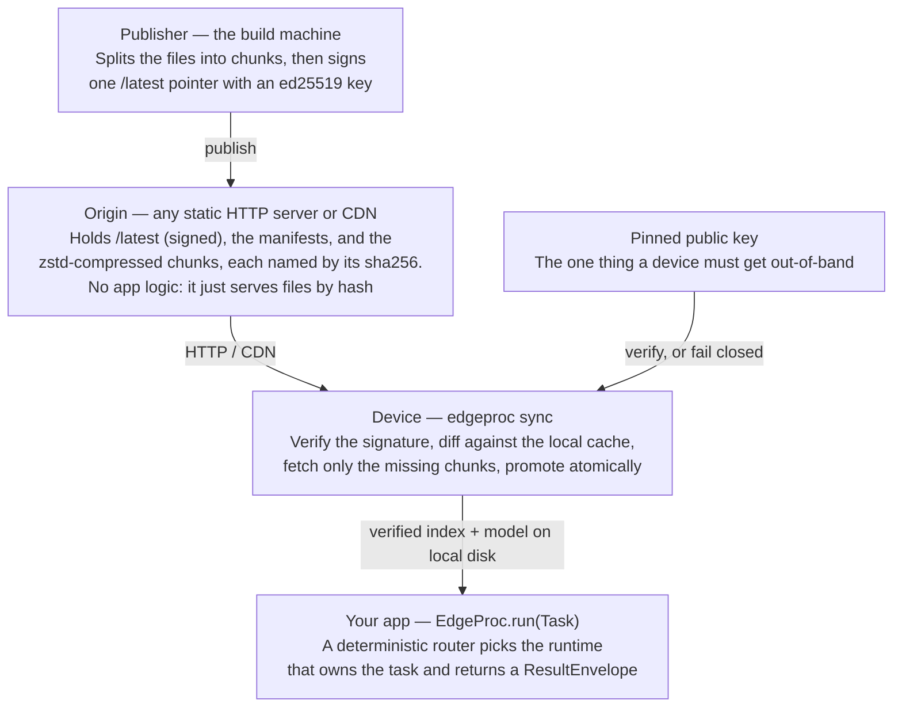
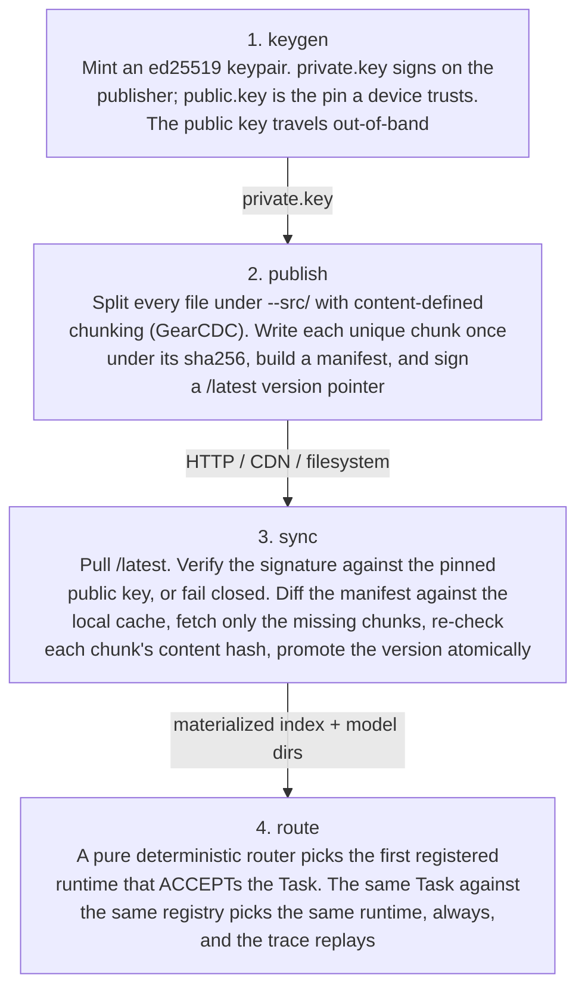
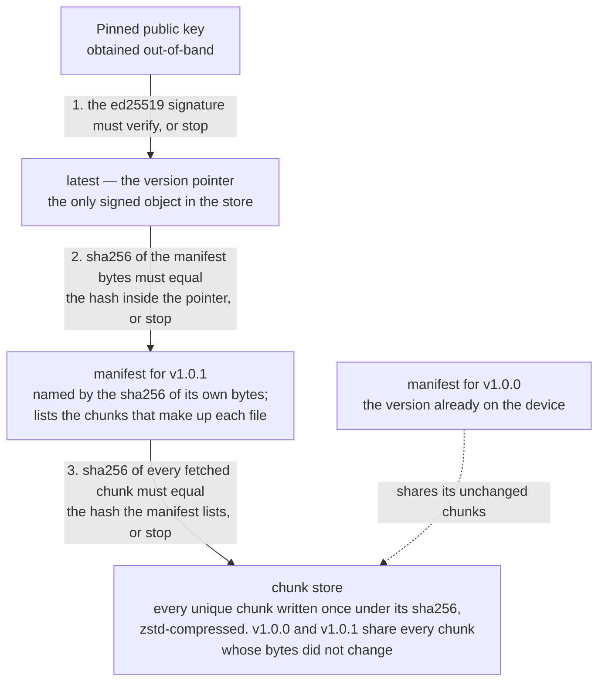

# Architecture

EdgeProc is a library you `import`. It does three things, in order:

1. **Pick** a runtime for a task (deterministic router — never an LLM).
2. **Run** the task on that runtime (local vector index, by default).
3. **Sync** the index and the embedding model that power it from a signed CDN-friendly origin, fail-closed.

The three live behind three small surfaces — `edgeproc.core`, `edgeproc.localvec`, `edgeproc.bundles` — wired together by `edgeproc.cli`. None of them depend on each other in a way that forces an opinion on the others: you can use `route` without `sync`, use `sync` to deliver any directory of files (not just an index), or register a different runtime entirely.

## System context

Three parties:

- **Publisher** (build-side) signs a `/latest` pointer once per release and writes content-addressed chunks under `origin/`.
- **Origin** is any static HTTP server or CDN. It has no app logic — it serves files by hash.
- **Consumer** runs `edgeproc sync` to pull the pointer, verify it against a pinned public key, fetch only the missing chunks, and atomically promote the new version. Then the consumer's app calls `EdgeProc.run(Task(...))` and a deterministic router picks the runtime that owns that task.

The trust boundary is the pinned public key. Everything an attacker could swap — chunks, manifests, the pointer, and the embedding model — is recomputed and verified locally, so the key is the only thing the consumer has to obtain out-of-band.

The model belongs in that list because it ships **inside the signed bundle as ordinary payload**, not as an ambient dependency the device resolves at first query. It used to be the exception, and that made the sentence above false: `TextEncoder`, handed a bare hub id, called huggingface.co while constructing itself, so a second unpinned artifact arrived out-of-band and nobody noticed — on a machine with a warm Hub cache the fetch is invisible. EdgeProc now refuses to fetch unless a deploy sets `EDGEPROC_ALLOW_MODEL_DOWNLOAD`, which is meant for the build machine that assembles the bundle. A model provisioned outside the bundle sits outside the verification chain until `EDGEPROC_MODEL_DIGEST` pins it; a directory whose bytes don't match the pin is refused as `bundle.integrity_failed`.

## Bundle lifecycle

Invariants — the security model in one screen:

- Only the **pointer** is signed.
- The **manifest** is named by the hash of its own content.
- Each **chunk** is named by the hash of its own content.
- Identical bytes across versions produce identical chunks, so a one-line edit re-fetches one
  chunk, not the whole file.
- Tamper with any chunk or manifest and it fails its content-address check.
- Forge the pointer and it fails the signature check.
- Both failures exit non-zero with no traceback.
- The embedding model is one of the files, so every line above covers it too.
- `route` never fetches a model. No local model configured means the query is refused
  (`config.missing`), not served by way of a download.

The four CLI verbs map one-to-one onto the four stages. `keygen` is one-time. `publish` runs on the build host whenever you cut a release. `sync` and `route` run on the device.

## Content-addressed store and manifest

Those three checks are the whole verification chain, top to bottom. Any one of them failing
aborts the sync — nothing is promoted and the process exits non-zero.

Chunk-level deduplication is the reason `v1.0.0 → v1.0.1` is a delta, not a full re-download. Identical bytes across versions resolve to identical chunk hashes, so the manifest for v1.0.1 simply references the same chunks as v1.0.0 wherever the file content didn't change. A one-line edit to a 400 KB index re-fetches one chunk.

## Module boundaries

| Module | Lives under | Extras flag | Responsibility |
|---|---|---|---|
| `edgeproc.core` | `edgeproc/core/` | (default) | `Task`, `ResultEnvelope`, `RuntimeRegistry`, deterministic `Router`, `EdgeProcSettings` |
| `edgeproc.localvec` | `edgeproc/localvec/` | `[localvec]` | `TextEncoder` and the fail-closed `model_source` resolver behind it, `FaissVectorIndex`, `KeywordSearcher` (BM25), reciprocal-rank fusion, `LocalVecRuntime` |
| `edgeproc.bundles` | `edgeproc/bundles/` | `[bundles]` | content-defined chunking (GearCDC), zstd compression, ed25519 signing, manifest types, `sync_index`, `FetchAdapter` (HTTP + filesystem) |
| `edgeproc.cli` | `edgeproc/cli/` | (default) | Typer entrypoints: `keygen`, `publish`, `sync`, `route` |

Heavy dependencies are opt-in. Installing the core gives you `Task`, the router, and the CLI shell. `[localvec]` brings FAISS + sentence-transformers. `[bundles]` brings cryptography + zstandard.

## Where the seams are

Three protocol seams are kept in v0 so future runtimes drop in without breaking consumers:

- **`Runtime`** — anything that can `ACCEPT` a `Task` and produce a `ResultEnvelope`. The router picks the first registered runtime that accepts.
- **`Encoder`** — anything that turns `list[str]` into normalized float32 embeddings. `TextEncoder` is sentence-transformers, loading from a local model directory unless a deploy explicitly permits a one-time fetch; `TextEncoder.save()` writes that directory so `publish` can sign it into the bundle. The seam lets a consumer plug in `onnx`, a remote service, or a fixture.
- **`FetchAdapter` / `CacheStore`** — `sync_index` doesn't know whether it's pulling over HTTP or off the filesystem. Both adapters ship; CDN-fronted edges, OPFS-backed browsers, and local-disk caches all reuse the same engine.

Roadmap seams not built in v0: a Wasmtime deterministic kernel, Biscuit capability tokens, and Sigstore-keyless bundles. The shipped path is pinned ed25519 over a content-addressed CAS, which is the production-real subset.

## Reading order

- New here? Start with [QUICKSTART.md](QUICKSTART.md), then come back.
- Want the security argument in detail? Re-read the content-addressed store diagram above, then `edgeproc/bundles/sync.py` and `edgeproc/bundles/signing.py`.
- Adding a runtime? Read `edgeproc/core/router.py`, then `edgeproc/localvec/runtime.py` as the reference implementation.
