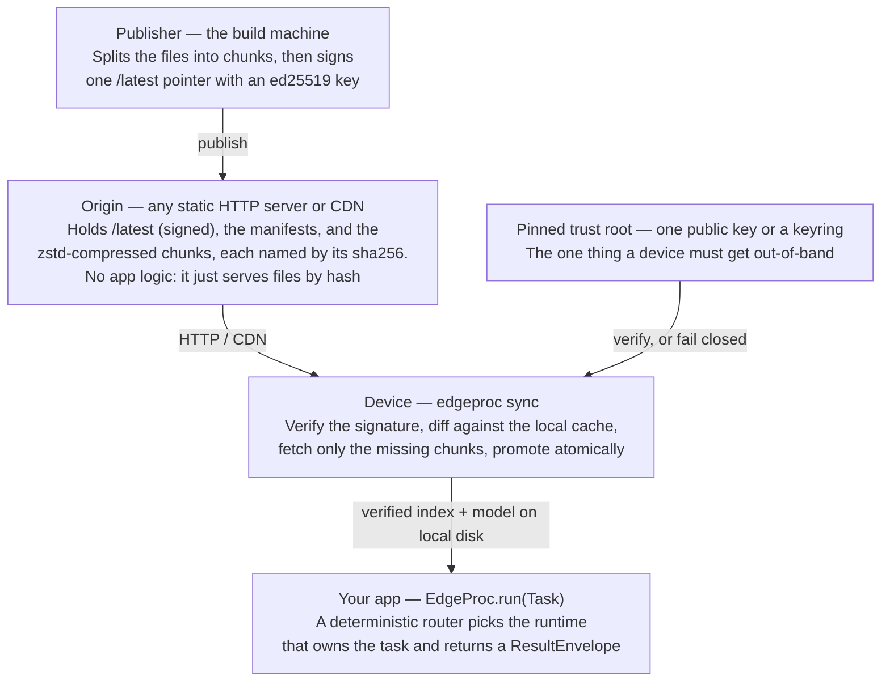
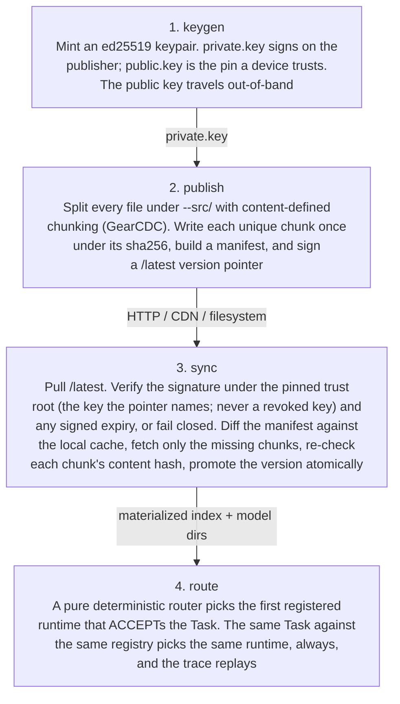
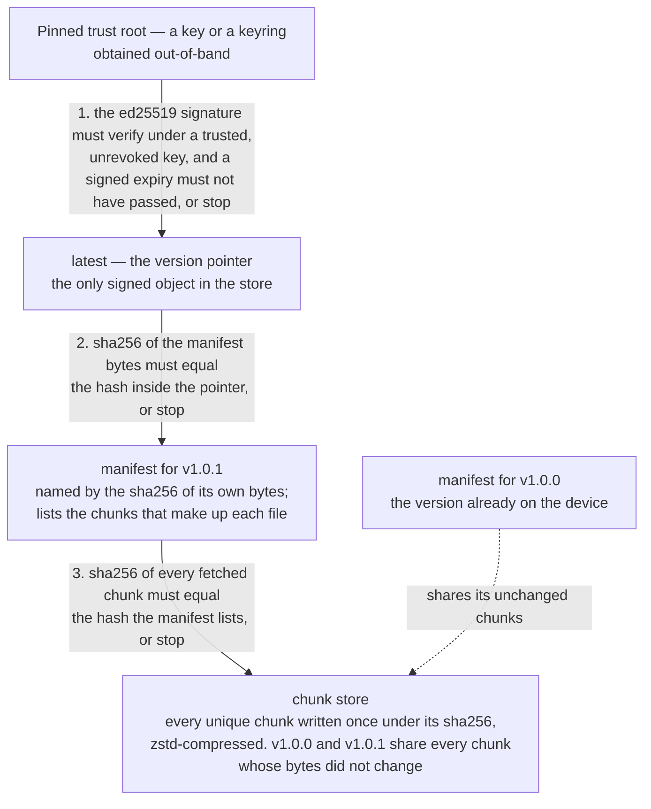

# Architecture

EdgeProc is a library you `import`. It does three things, in order:

1. **Pick** a runtime for a task (deterministic router — never an LLM).
2. **Run** the task on that runtime (local vector index, by default).
3. **Sync** the index and the embedding model that power it from a signed CDN-friendly origin, fail-closed.

The three live behind three small surfaces — `edgeproc.core`, `edgeproc.localvec`, `edgeproc.bundles` — wired together by `edgeproc.cli`. None of them depend on each other in a way that forces an opinion on the others: you can use `route` without `sync`, use `sync` to deliver any directory of files (not just an index), or register a different runtime entirely.

## System context



Three parties:

- **Publisher** (build-side) signs a `/latest` pointer once per release and writes content-addressed chunks under `origin/`.
- **Origin** is any static HTTP server or CDN. It has no app logic — it serves files by hash.
- **Consumer** runs `edgeproc sync` to pull the pointer, verify it against its pinned trust root, fetch only the missing chunks, and atomically promote the new version. Then the consumer's app calls `EdgeProc.run(Task(...))` and a deterministic router picks the runtime that owns that task.

The trust boundary is the pinned trust root: a single raw public key (`public.key`, what `keygen` writes) or a **keyring** of several keys with a revocation list (`edgeproc.keyring/v1`, built with `edgeproc keyring`). Everything an attacker could swap — chunks, manifests, the pointer, and the embedding model — is recomputed and verified locally, so the trust root is the only thing the consumer has to obtain out-of-band. A keyring is what makes rotation an overlap instead of a cutover: pin `{old, new}`, switch the publisher, then pin `{new, revoked old}` (runbook: [OPERATIONS.md](OPERATIONS.md#key-rotation-and-compromised-key-runbook)).

The model belongs in that list because it ships **inside the signed bundle as ordinary payload**, not as an ambient dependency the device resolves at first query. It used to be the exception, and that made the sentence above false: `TextEncoder`, handed a bare hub id, called huggingface.co while constructing itself, so a second unpinned artifact arrived out-of-band and nobody noticed — on a machine with a warm Hub cache the fetch is invisible. EdgeProc now refuses to fetch unless a deploy sets `EDGEPROC_ALLOW_MODEL_DOWNLOAD`, which is meant for the build machine that assembles the bundle. A model provisioned outside the bundle sits outside the verification chain until `EDGEPROC_MODEL_DIGEST` pins it; a directory whose bytes don't match the pin is refused as `bundle.integrity_failed`.

## Bundle lifecycle



Invariants — the security model in one screen:

- Only the **pointer** is signed.
- The **manifest** is named by the hash of its own content.
- Each **chunk** is named by the hash of its own content.
- Identical bytes across versions produce identical chunks, so a one-line edit re-fetches one
  chunk, not the whole file.
- Tamper with any chunk or manifest and it fails its content-address check.
- Forge the pointer and it fails the signature check.
- A pointer that names its `key_id` is checked under that key only: a revoked key is refused
  at any `sequence`, and a key the trust root does not hold is refused as unknown.
- A pointer past its signed `expires_at` is refused — judged only after the signature verified.
- Both failures exit non-zero with no traceback.
- The embedding model is one of the files, so every line above covers it too.
- `route` never fetches a model. No local model configured means the query is refused
  (`config.missing`), not served by way of a download.

Four CLI verbs map one-to-one onto the lifecycle stages: `keygen` is one-time, `publish` runs
on the build host, and `sync` plus `route` run on the device. Three administrative commands
complete the shipped CLI: `version` reports the package identity, `list-runtimes` shows runtime
availability, and `gc` reclaims unreferenced bundle objects behind the mutation lock. `keyring`
(`init` · `add` · `revoke` · `show`) maintains a keyring trust root for rotation and revocation.

## Content-addressed store and manifest



Those three checks are the whole verification chain, top to bottom. Any one of them failing
aborts the sync — nothing is promoted and the process exits non-zero.

Chunk-level deduplication is the reason `v1.0.0 → v1.0.1` is a delta, not a full re-download. Identical bytes across versions resolve to identical chunk hashes, so the manifest for v1.0.1 simply references the same chunks as v1.0.0 wherever the file content didn't change. A one-line edit to a 400 KB index re-fetches one chunk.

## Module boundaries

| Module | Lives under | Extras flag | Responsibility |
|---|---|---|---|
| `edgeproc.core` | `edgeproc/core/` | (default) | `Task`, `ResultEnvelope`, `RuntimeRegistry`, deterministic `Router`, `EdgeProcSettings` |
| `edgeproc.localvec` | `edgeproc/localvec/` | `[localvec]` | `TextEncoder` and the fail-closed `model_source` resolver behind it, `FaissVectorIndex`, `KeywordSearcher` (BM25), reciprocal-rank fusion, `LocalVecRuntime` |
| `edgeproc.bundles` | `edgeproc/bundles/` | `[bundles]` | content-defined chunking (GearCDC), zstd compression, ed25519 signing, the trust-root keyring (`key_id`, revocation), manifest types, `sync_index`, `FetchAdapter` (HTTP + filesystem) |
| `edgeproc.cli` | `edgeproc/cli/` | (default) | Typer entrypoints: `version`, `list-runtimes`, `sync`, `keygen`, `keyring`, `publish`, `route`, `gc` |

Heavy dependencies are opt-in. Installing the core gives you `Task`, the router, and the CLI shell. `[localvec]` brings FAISS + sentence-transformers. `[bundles]` brings cryptography + zstandard.

`FaissVectorIndex.save()` treats the FAISS binary and metadata as one value: it flushes
generation-addressed files, then publishes one atomic manifest. Save, writable load,
migration, and GC share a bounded cross-process lock, and only the current plus previous
complete generation remain. Stable read-only loads do not take that lock: they pin the
selected files before digest verification and retry when concurrent cleanup changes the
manifest set. A valid immutable legacy pair loads without migration or other writes. Three
unstable observations fail closed rather than returning a hybrid. An interrupted generation
is never paired with another generation's sidecar.

## Where the seams are

Three protocol seams are kept in v0 so future runtimes drop in without breaking consumers:

- **`Runtime`** — anything that can `ACCEPT` a `Task` and produce a `ResultEnvelope`. The router picks the first registered runtime that accepts.
- **`Encoder`** — anything that turns `list[str]` into normalized float32 embeddings. `TextEncoder` is sentence-transformers, loading from a local model directory unless a deploy explicitly permits a one-time fetch; `TextEncoder.save()` writes that directory so `publish` can sign it into the bundle. The seam lets a consumer plug in `onnx`, a remote service, or a fixture.
- **`FetchAdapter` / `CacheStore`** — `sync_index` doesn't know whether it's pulling over HTTP or off the filesystem. Both adapters ship; CDN-fronted edges, OPFS-backed browsers, and local-disk caches all reuse the same engine.

Roadmap seams not built in v0: a Wasmtime deterministic kernel, Biscuit capability tokens, and Sigstore-keyless bundles. The shipped path is pinned ed25519 over a content-addressed CAS, which is the production-real subset.

## Design in plain terms

- **Every file is split into chunks, and each chunk is named by a fingerprint of its own
  contents.** That fingerprint (a SHA-256 hash) changes completely if even one byte changes —
  so a corrupted or tampered chunk no longer matches the name it was requested under, and is
  refused. The technical name for this is a *content-addressed store*, or CAS.
- **Exactly one small file is signed, and it vouches for everything else.** The publisher signs
  a *version pointer*: a few bytes saying "version 1.0.1 is live, and its file list is
  `<hash>`". That file list (the *manifest*) names every chunk by hash. So one signature check
  covers the entire release, and there's only one secret to protect.
- **Chunk boundaries follow the content, not fixed offsets.** Edit one line in the middle of a
  big file and only the chunk holding that line changes — everything after it keeps its old
  fingerprint instead of shifting. That's what makes the next update a small delta.
- **If verification fails, nothing is installed.** Not "installed with a warning." The sync
  exits non-zero and the previous good version stays live.

Once the data has landed, EdgeProc also runs the search and ranking **on the device** — no
embedding API, no vector database, no ranking server in the request path.

Chunking is content-defined (GearCDC) and chunks are zstd-compressed. Add `--http` to `sync`,
serving `origin/` over any static HTTP server or CDN, to go over the wire instead of the
filesystem; the contract is identical and only the transport changes.

## Security and trust model

- **Verified:** one signed version pointer (Ed25519, checked against a public key or keyring
  you pin on the device), the file list it names, and every downloaded piece against its
  SHA-256 fingerprint. A shipped search model can be pinned by digest
  (`EDGEPROC_MODEL_DIGEST`).
- **Refuses rather than warns:** no trust root means `sync` refuses to run; a bad signature, a
  tampered piece, or a rolled-back pointer stops the sync with a non-zero exit and nothing is
  promoted, and so do an expired pointer and a revoked key. With no local model, search refuses
  instead of downloading one.
- **Not protected:** a compromised device or build machine, a stolen private key before you
  revoke it (revocation takes effect when you update each device's pinned keyring — there is
  no remotely fetched revocation list), and what your own app does with the data after it is
  verified. The memory budget is admission control, not a hard limit (see
  [below](#the-typed-result-and-the-taskbudget-model)).
- **Verify a release:** PyPI releases are published from CI with
  [PEP 740](https://peps.python.org/pep-0740/) provenance. Check a wheel with
  `pip install pypi-attestations && pypi-attestations verify pypi --repository https://github.com/hseshadr/edge-proc pypi:edge_proc-0.5.0-py3-none-any.whl`.
  The release procedure is in [docs/OPERATIONS.md](OPERATIONS.md#release-evidence).

See [SECURITY.md](../SECURITY.md) for reporting a vulnerability. The threat model, recovery
contract, and key-rotation runbook are in [docs/OPERATIONS.md](OPERATIONS.md).

### The verification chain, precisely

`sync` verifies the pointer signature against the pinned trust-root pubkey **before trusting
anything**, diffs the manifest against the local cache, fetches only missing chunks, re-checks
every chunk against its content address, and only then atomically promotes the new version. A
tampered chunk fails its content-address check; a forged pointer fails its signature check —
both exit non-zero with no traceback, and neither promotes into the cache.

### Key rotation: a keyring trust root

`--key` / `EDGEPROC_TRUST_ROOT_PUBKEY_PATH` accepts the raw `public.key` above (a keyring of
one — exactly the single-key behavior) or a JSON keyring of several keys plus a revocation
list. A pointer can name the key that signed it (`publish --stamp-key-id`) and carry a signed
expiry (`publish --expires-in 7d`); a revoked key never verifies, an unknown one is refused,
and an expired pointer is refused after its signature checks out. The `sequence` rollback
floor holds across keys. The keyring ships in 0.5.0.

```bash
edgeproc keyring init keys/public.key new-keys/public.key --out keyring.json
edgeproc keyring revoke keyring.json <old-key-id>   # after the publisher switched
edgeproc keyring show keyring.json --pretty
```

Both stamps are **off by default**, because a consumer older than the keyring release refuses
a pointer carrying them: upgrade every consumer first, then turn stamping on. The overlap
procedure, the compromised-key path, and the re-sign cadence are in the
[operations runbook](OPERATIONS.md#key-rotation-and-compromised-key-runbook).

## What this proves / what it does not prove

| Claim | Evidence |
| --- | --- |
| A tampered piece or a missing trust root is refused, with a stable error code | The README's Try it example; the fail-closed tests under [`tests/bundles/`](../tests/bundles/) and [`tests/cli/`](../tests/cli/) |
| An update downloads only changed pieces | The README's Try it example (27 bytes for the second release); the delta step of `bash examples/run_loop.sh` |
| After one sync, search needs no network | [`tests/localvec/test_offline_model.py`](../tests/localvec/test_offline_model.py) points every Hugging Face cache at an empty folder and proves the model loader is never constructed |
| Routing is deterministic, with no AI in the decision | Router tests under [`tests/core/`](../tests/core/) |
| Every documented setting exists, and vice versa | `tests/test_release_contract_docs.py` checks the [configuration table](CONFIGURATION.md) field for field |
| Latency and memory stay under budget | `uv run python benchmarks/benchmark.py` prints your own numbers; recorded figures and hardware live only in [docs/OPERATIONS.md](OPERATIONS.md#measured-evidence) |

`poe gate` is the product-quality portion of the hosted `Dagger` job. Dagger also runs the real
example, benchmark, locked dependency audit, exact snapshot plus full commit-history secret scan,
and workflow validation. A green local product gate alone is not evidence that those controls ran.

**Not proven here:** behavior on Windows or macOS in CI (CI runs Linux); a hard memory cap
inside FAISS or other native code; protection after a device itself is compromised; recall
quality of the default search model on your data.

## The router, tasks, and saved indexes

### The deterministic router

You hand EdgeProc a `Task` and a router picks which engine (a "runtime") serves it. **That
router is a plain rulebook, never an AI** — it asks each registered runtime "do you accept this
task?" and picks the first that says yes. Because it's a pure function, the same `Task` against
the same runtimes always routes the same way, so a trace is replayable and you can prove which
runtime touched a request.

### The typed result and the Task/budget model

A `Task` carries its `kind` (`EMBED` / `SEARCH` / `RANK`), a `payload`, a `privacy_mode`, and a
latency/memory **budget declaration**. `EdgeProc` admits work through a thread-safe
`MemoryManager`: the sum of declared in-flight reservations cannot exceed
`max_in_flight_memory_mb`, and every reservation releases in a `finally`-safe context. This is
deterministic admission control, **not** a native-RSS limit: the budget remains a declaration,
not an enforcement boundary for allocations inside FAISS, NumPy, or another native runtime. The
host or container owns RSS, CPU, and process-level termination. Share one `MemoryManager` across
facades when they share a process.

Every run returns a typed `ResultEnvelope` — a structured object with `success`, the serving
`runtime`, `latency`, and the `payload` — not a loose dict. Typed in, typed out.

### Saved indexes and concurrent readers

Local vector snapshots are generation-addressed: a writer flushes the FAISS and state files,
then exposes both with one atomic manifest commit. Writes, writable loads, migration, and
snapshot cleanup share a bounded cross-process lock. **Stable read-only loads do not take that
lock**: they pin open descriptors for one observed generation, verify both digests through
those handles, and retry if concurrent cleanup changes the manifest set. On an immutable
legacy 0.4.0 directory, a valid two-file pair can be read directly without creating a snapshot
directory, migrating, or deleting either source file. A reader gets three attempts to observe
a stable manifest set; continuing writer/GC churn then fails closed instead of returning a
hybrid snapshot.

## Reading order

- New here? Start with [QUICKSTART.md](QUICKSTART.md), then come back.
- Want the security argument in detail? Re-read the content-addressed store diagram above, then `edgeproc/bundles/sync.py`, `edgeproc/bundles/signing.py`, and `edgeproc/bundles/keyring.py`.
- Adding a runtime? Read `edgeproc/core/router.py`, then `edgeproc/localvec/runtime.py` as the reference implementation.
